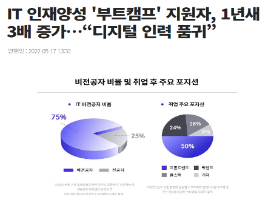
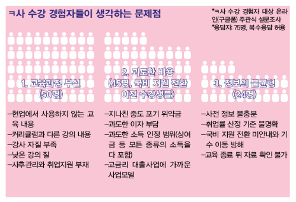
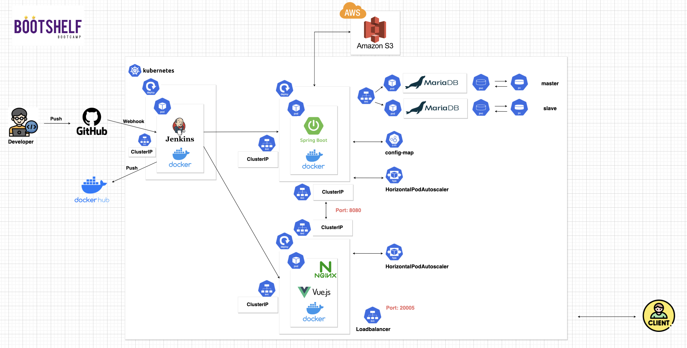

 

> **[플레이 데이터] 한화시스템 BEYOND SW캠프 / 📚 Team : BuildUp 📚**

 

### 🤼‍♂️ 팀원 소개

 

 
<table>
    <tr>
        <td align="center">
            
                
        </td>
        <td align="center">
            
        </td>
        <td align="center">
            
        </td>
        <td align="center">
            
        </td>
        <td align="center">
            
        </td>
    </tr>
    <tr>
        <td align="center">
            <b>유형도</b>
        </td>
        <td align="center">
            <b>임태우</b>
        </td>
        <td align="center">
            <b>홍현주</b>
        </td>
        <td align="center">
            <b>강지흔</b>
        </td>
        <td align="center">
            <b>길민석</b>
        </td>
    </tr>
    <tr>
        <td align="center"">
            <b>Backend/frontend</b>
        </td>
        <td align="center">
            <b>Backend/frontend</b>
        </td>
        <td align="center">
            <b>Backend/frontend</b>
        </td>
        <td align="center">
            <b>Backend/frontend</b>
        </td>
        <td align="center">
            <b>Backend/frontend</b>
        </td>
    </tr>
</table>

 

---

### ✨ 프로젝트 기본 소개

- 최근 들어 디지털 인재 수요가 계속해서 늘어나고 있는 만큼 개발자 양성 **부트캠프, 국비지원교육이 증가**

&nbsp;&nbsp;&nbsp;&nbsp;　하고 있다.

- 수 많은 교육 과정들로 인해 훗날 개발자를 희망하는 준비생들이 교육 커리큘럼, 강사에 관한 정보 부족 등의

&nbsp;&nbsp;&nbsp;&nbsp;　이유로 **선택의 어려움을 겪고 있는 것이 현실**이다.

- **“BootShelf”** 서비스는 교육 희망생들에게 실제 프로그램을 수강했거나, 수강하고 있는 교육생들의 교육과정

&nbsp;&nbsp;&nbsp;&nbsp;　또는 강사의 후기/평점을 확인하여 **선택의 폭을 줄여주고**, 수강생들 간의 교육 간 궁금증, 해결한 내용 등의

&nbsp;&nbsp;&nbsp;&nbsp;　**지식을 서로 공유하는 서비스를 제공**한다.

 

---

### 🧐 프로젝트 배경

 

<figure class="half">
 &nbsp;&nbsp;&nbsp;
 
</figure>
 

 

- IT 인재양성 스타트업 코드스테이츠가 자사 부트캠프 지원자와 수강생 데이터를 분석하여 **“2021 IT 교육 트렌드**

&nbsp;&nbsp;&nbsp;&nbsp;　**리포트”** 를 발표한 결과, 2021년 코드스테이츠 부트캠프 지원자는 총 2만4571명으로, 2020년 6273명 대비 

&nbsp;&nbsp;&nbsp;&nbsp;　**292% 증가**한 것으로 확인됐다. 한 해 동안 교육 프로그램 지원자 수가 약 4배로 상승한 것이다. 이처럼, 개발자를 

&nbsp;&nbsp;&nbsp;&nbsp;　꿈꾸고 **국비지원교육, 부트캠프교육을 희망하는 비전공자들이 지속적으로 상승**하고 있다.

 

- “ㅋ사” 교육을 수강한 사람들을 대상으로 조사한 결과 국비지원교육, 부트캠프의 가장 큰 **문제점으로 교육과정**

&nbsp;&nbsp;&nbsp;&nbsp;　**부실, 정보의 불균형** 등을 뽑았다. 실제로 A교육생은 다음과 같이 답변했다. “질문하면 만족할 만한 수준의 답변이 

&nbsp;&nbsp;&nbsp;&nbsp;　나오지 않는 경우가 많았어요. (강사들도) 수업 준비 부족이 많이 느껴졌고요. 학원하고 실력 없는 강사만 배부른

&nbsp;&nbsp;&nbsp;&nbsp;　상황이라고 생각해요.” 또한 B교육생은 “어떻게 구글링해야 잘 나오는지 알려줘야 하는데 그냥 하라고만 했다” 등

&nbsp;&nbsp;&nbsp;&nbsp;　강사들의 실력 문제도 지속적으로 거론되고 있는 것이 현실이다.

 

---

### 📌 기술 스택

#### &nbsp;　[ DB ]

&nbsp;&nbsp;&nbsp;</a>

#### &nbsp;　[ Backend ]

&nbsp;&nbsp;&nbsp;</a></a>
&nbsp;&nbsp;&nbsp;</a></a>
&nbsp;&nbsp;&nbsp;</a></a>
&nbsp;&nbsp;&nbsp;&nbsp;</a></a>

#### &nbsp;　[ Frontend ]

&nbsp;&nbsp;&nbsp;&nbsp;&nbsp;&nbsp;&nbsp;&nbsp;&nbsp;&nbsp;&nbsp;&nbsp;&nbsp;&nbsp;&nbsp;&nbsp;
&nbsp;&nbsp;&nbsp;&nbsp;</a>
&nbsp;&nbsp;&nbsp;&nbsp;</a></a>
&nbsp;&nbsp;&nbsp;&nbsp;</a></a>
&nbsp;&nbsp;&nbsp;&nbsp;</a></a>

#### &nbsp;　[ CI/CD ]

&nbsp;&nbsp;&nbsp;&nbsp;</a></a>
&nbsp;&nbsp;&nbsp;&nbsp;</a></a>
&nbsp;&nbsp;&nbsp;&nbsp;</a></a>
&nbsp;&nbsp;&nbsp;&nbsp;</a></a>
&nbsp;&nbsp;&nbsp;&nbsp;</a></a>
&nbsp;&nbsp;&nbsp;&nbsp;</a></a>
&nbsp;&nbsp;&nbsp;&nbsp;</a></a>
&nbsp;&nbsp;&nbsp;&nbsp;</a></a>
&nbsp;&nbsp;&nbsp;&nbsp;</a></a>

 

---

### 📚 프로젝트 기획

### &nbsp;&nbsp;&nbsp;&nbsp;&nbsp;&nbsp; 🔗 [WBS 바로가기](https://docs.google.com/spreadsheets/d/13p4rbHRj4yU6FU8hGdU-2VQ5eIj3EGHB/edit#gid=1297511367)

### &nbsp;&nbsp;&nbsp;&nbsp;&nbsp;&nbsp; ✍ [요구사항 정의서 바로가기](https://docs.google.com/spreadsheets/d/1zWRshDDYx6A5WiRITPbgeP8Y-cxG2I0w/edit#gid=19011910)

 

---

### 📜 프로젝트 설계

 

  

    
<b>📝 ERD</b>

        
  

 

  

    
<b>⏳ 릴레이션 스키마</b>

        
  

 

---
### 🌈 [화면 설계도 ( Figma ) 바로가기](https://www.figma.com/file/EPxkgc0NKKEkoXUjaHuRRm/BuildUp-%ED%99%94%EB%A9%B4-%EC%84%A4%EA%B3%84%EC%84%9C?type=design&node-id=0-1&mode=design&t=qNlrkmOxFiZFf7ZB-0)

 

### 💻 [API 명세서 바로가기](https://www.notion.so/API-639ea057342142a180469afce0c6c7d9)

 

---

### 🚀 시스템 아키텍처

 

<b>CI/CD 적용 전</b>

 

#### ➡ 프론트엔드 서버 : Nginx

- Vue.js가 배포되어 있는 Nginx 서버로 클라이언트가 HTTP 요청을 보낸다.

- 요청 URL 은 http://[프론트엔드 서버 IP]/api 형태이며, Nginx 서버 **Reverse Proxy 설정**을 통해 URL에 "/api" 가

&nbsp;&nbsp;&nbsp;&nbsp;　포함되어 있는 요청을 백엔드 서버로 보내준다.

#### ➡ 백엔드 서버 : Spring Boot

- Spring Boot로 개발하였으며, 레이어드 아키텍처를 적용하였다.

- 벡엔드 서버에서는 **"Spring Security"** 를 이용하여 헤더에 포함된 JWT 토큰을 통해
  사용자의 권한을 확인 후

&nbsp;&nbsp;&nbsp;&nbsp;　**권한에 따라 서비스 이용을 제한적으로 허가**해준다.

- 백엔드 서버는 데이터 처리를 위해 Spring Data JPA를 사용하여 DB 서버 (MariaDB) 에 접근하며,
  조회 (SELECT)

&nbsp;&nbsp;&nbsp;&nbsp;　요청은 N+1 문제를 해결하기 위해 QueryDSL을 사용하였다.

#### ➡ DB 서버 : MariaDB

- MariaDB를 **Master - Slave 이중화로 구성**하였으며, 부하 분산을 위해 Read 요청은
  Slave 서버에게, Write 요청은

&nbsp;&nbsp;&nbsp;&nbsp;　 Master에게 전달한다.

#### ➡ 이미지 저장 : AWS S3

- 게시글, 후기 및 프로필 이미지를 AWS S3에 각 버킷별로 저장하고, DB에는 각각 저장된 이미지의 URL을

&nbsp;&nbsp;&nbsp;&nbsp;　저장한다.

- 클라이언트가 이미지를 요청하면, 이미지가 저장된 URL을 반환, AWS S3에서 이미지를 불러와서 보여준다.

 

<b>CI/CD 적용 후</b>

#### ➡ 형상관리 : GitHub

- 각각의 브랜치( ex : backend/feature/user/login ) 에 최신 버전의 백엔드 또는 프론트엔드 프로젝트를 

&nbsp;&nbsp;&nbsp;&nbsp;　"Push" 한다.

- 깃허브 develop 브랜치에 최신 버전의 프로젝트가 이상없는 것을 확인 후 "Pull requests" 를 통해

&nbsp;&nbsp;&nbsp;&nbsp;　 **라벨(backend 또는 frontend) 을 달고 Merge** 시킨다.

- develop 브랜치에 Merge 시 깃허브는 젠킨스에게 WebHook을 보낸다.

#### ➡ CI/CD 도구 : Jenkins, Slack

- 깃허브로부터 WebHook을 수신한 젠킨스에서는 **라벨을 확인**하여, "backend" 라벨이면 백엔드 파이프라인으로,

&nbsp;&nbsp;&nbsp;&nbsp;　"frontend" 라벨이면 프론트엔드 파이프라인으로 요청이 들어온다.

- 깃 클론 후 각각의 파이프라인 단계별 절차를 진행하며, 절차 진행 간 성공, 실패 여부를 **슬랙 알람**으로 보낸다.

#### ➡ 컨테이너화 플랫폼 : 도커

- 프론트엔드, 백엔드 프로젝트 수정 시 젠킨스 빌드 번호를 버전으로 하는 도커 이미지를 생성, 도커허브로

&nbsp;&nbsp;&nbsp;&nbsp;　푸쉬한다.

&nbsp;&nbsp;&nbsp;&nbsp;　🎨 **프론트엔드 : bootshelf-fe:2.VERSION**

&nbsp;&nbsp;&nbsp;&nbsp;　🧑‍💻 **백엔드 : bootshelf-be:2.VERSION**

#### ➡ 컨테이너 오케스트레이션 툴 : 쿠버네티스 (k8s)

- 프론트엔드, 백엔드 서버는 각각 **Deployment 로 파드를 생성**, DB 서버는 **StatefulSet 으로 파드를 생성**한다.

- 프론트엔드, 백엔드 파드에는 **HPA(Horizontal Pod Autoscaler) 설정을 통해 리소스를 자동으로 관리**한다.

- 클라이언트는 **LoadBalancer 타입의 서비스**를 통해 프론트엔드 서버에 접근하고, Nginx Reverse Proxy 설정을

&nbsp;&nbsp;&nbsp;&nbsp;　통해 백엔드 서비스로 요청을 보낸다. 

- 백엔드와 DB 간의 통신은 **ClusterIP 타입의 서비스**를 통해서 서비스 내부에서 이루어진다.

 

 

---