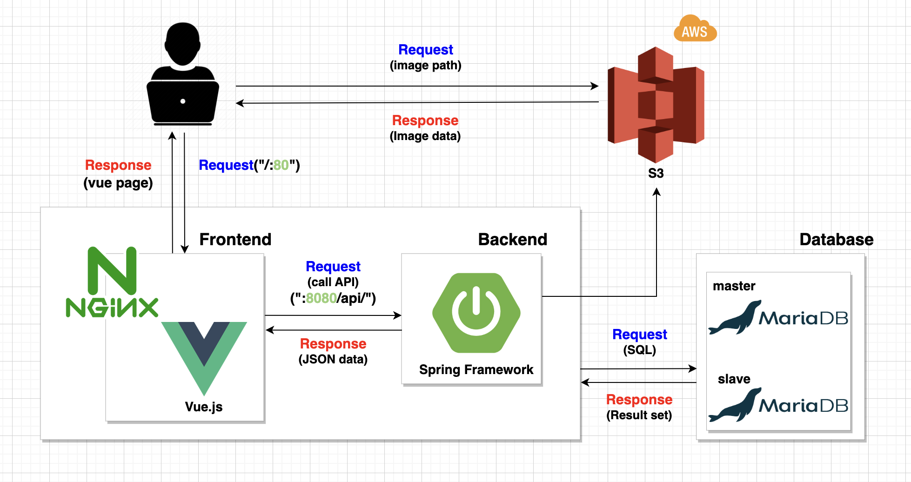

 

> **[플레이 데이터] 한화시스템 BEYOND SW캠프 / 📚 Team : BuildUp 📚**

 

## 🤼‍♂️ 팀원 소개

  

&nbsp;　&nbsp;　&nbsp;　&nbsp;　&nbsp;　&nbsp;　&nbsp;　&nbsp;　 🦁 **[유형도](https://github.com/hyungdoyou)**&nbsp;　 🐻 **[임태우](https://github.com/Tesssssssssy)** &nbsp;　 🐶 **[홍현주](https://github.com/hyeonjju)** &nbsp;　 🐱 **[강지흔](https://github.com/heueun)** &nbsp;　 🐼 **[길민석](https://github.com/gilms0730)**
     

## ✨ 프로젝트 기본 소개

 

- 최근 들어 디지털 인재 수요가 계속해서 늘어나고 있는 만큼 개발자 양성 **부트캠프, 국비지원교육이 증가**하고 있다.

- 수 많은 교육 과정들로 인해 훗날 개발자를 희망하는 준비생들이 교육 커리큘럼, 강사에 관한 정보 부족 등의 이유로 **선택의 어려움을 겪고 있는 것이 현실**이다.

- **“BootShelf”** 서비스는 교육 희망생들에게 실제 프로그램을 수강했거나, 수강하고 있는 교육생들의 교육과정 또는 강사의 후기/평점을 확인하여 **선택의 폭을 줄여주고**, 수강생들 간의 교육 간 궁금증, 해결한 내용 등의 **지식을 서로 공유하는 서비스를 제공**한다.

 

## 💻 시스템 아키텍쳐

 

 

## 🔥 STACKS

 

&nbsp;&nbsp;&nbsp;&nbsp;&nbsp;&nbsp;&nbsp;&nbsp;&nbsp;&nbsp;&nbsp;&nbsp;&nbsp;&nbsp;&nbsp;&nbsp;&nbsp;&nbsp;&nbsp;&nbsp;
&nbsp;&nbsp;&nbsp;&nbsp;</a>
&nbsp;&nbsp;&nbsp;&nbsp;</a></a>
&nbsp;&nbsp;&nbsp;&nbsp;</a></a>
&nbsp;&nbsp;&nbsp;&nbsp;</a></a>
&nbsp;&nbsp;&nbsp;&nbsp;</a></a>
&nbsp;&nbsp;&nbsp;&nbsp;</a></a>
&nbsp;&nbsp;&nbsp;&nbsp;</a></a>
&nbsp;&nbsp;&nbsp;&nbsp;</a></a>
&nbsp;&nbsp;&nbsp;&nbsp;

 

## 🔧 기능 명세서

<h3><a href="https://www.figma.com/file/EPxkgc0NKKEkoXUjaHuRRm/BuildUp-%ED%99%94%EB%A9%B4-%EC%84%A4%EA%B3%84%EC%84%9C?type=design&node-id=0%3A1&mode=design&t=dESqyR1knoAuCHsU-1"> figma 바로가기</a></h3>

 

## ⏩ 프로젝트 시연 영상

  
👩‍💼 회　　　원 👨‍💼

 

<!---------------------------------- 회원가입 ---------------------------------------->
### 회원가입

  

    
일반 회원가입 및 이메일 인증

 

➡ 부트캠프를 수강하지 않은 일반 회원이 가입을 할 수 있다.

➡ 회원 정보  [ 이메일, 패스워드, 이름, 닉네임, 프로필 사진 ]를 입력하여 가입한다.

➡ 회원이 입력한 이메일로 온 인증메일을 통해 이메일 인증을 완료한 후 로그인이 가능하다.

  

 

  

    
 인증 회원가입 및 이메일 인증

 

➡ 부트캠트를 수강한 회원이 부트캠프 내역을 인증하여 가입한다.

➡ 회원 정보 [ 이메일, 패스워드, 이름, 닉네임, 프로필 이미지, "나의 훈련 이력" 캡처사진] 를 입력하여 가입한다.

➡ 회원이 입력한 이메일로 온 인증메일을 통해 이메일 인증을 완료한 후 로그인이 가능하다.

  

 
 
<!----------------------------마이페이지(프로필)------------------------------------->

### 마이페이지 - 프로필

  

    
 회원 정보 수정

 

➡ 마이페이지 - 프로필 메뉴에서 회원 정보 수정이 가능하다.

➡ 회원이 수정하고 싶은 내용 [패스워드, 닉네임, 프로필이미지] 을 입력하여 회원 정보를 수정한다.

  

  

 

  

    
 회원 탈퇴 

 

➡ 마이페이지 - 프로필 메뉴에서 회원 탈퇴가 가능하다.

➡ 회원이 마이페이지의 "회원 탈퇴" 버튼을 클릭하여 진행한다.
  
  
  

 
 
<!----------------------------마이페이지(나의활동) ------------------------------------>

### 마이페이지 - 나의 활동

  

    
 작성글 내역 확인 

 

➡ 일반/인증회원은 마이페이지-나의 활동에서 본인이 게시판별 작성한 게시물을 확인할 수 있다.

➡ 기본은 최신순이며 드롭다운 메뉴로 추천, 조회, 스크랩, 댓글순으로 조회 가능하다.

  
  

  

 

  

    
 스크랩 내역 확인 

 

➡ 일반/인증회원은 마이페이지-나의 활동에서 본인이 게시판별 스크랩 게시물을 확인할 수 있다.

➡ 기본은 최신순이며 드롭다운 메뉴로 추천, 조회, 스크랩, 댓글순으로 조회 가능하다.

  
  

  

 
 
<!-----------------------------------------메인페이지-------------------------------------->

### 메인페이지  
  

    
 메인페이지 - 검색 

 

➡ 검색창에 원하는 키워드로 검색할 수 있다.

➡ 검색 시 제목 or 제목+내용을 선택하여 해당 키워드가 포함된 게시글들을 조회할 수 있다.

  

  

 

  

    
 메인페이지 - 메뉴 

 

➡ 회원/비회원은 메뉴 이동이 가능하다.

➡ 메인 페이지에서 스크롤 시 보이는 버튼으로 메뉴 이동이 가능하다.

  
  

 
 
<!-----------------------------------------게시판 crud-------------------------------------->

### 지식공유,  Q&A, 스터디 게시판

  

    
 게시글 전체 목록 조회 

➡ 회원/비회원은 작성된 게시물들을 조회할 수 있다.

➡ 기본은 최신순이며, 드롭다운 메뉴를 통하여 추천, 조회, 스크랩, 댓글순으로 조회 가능하다.

  

  

 

  

    
  게시글 상세 목록 조회 

➡ 회원/비회원은 작성된 게시물들을 조회할 수 있다.

  

  

 

  

    
 게시글 검색 

➡ 회원/비회원은 검색창에 키워드를 입력하여 검색하면 제목+내용에 포함된 게시글들을 조회 가능하다.

➡ 기본은 최신순이며, 드롭다운 메뉴를 통하여 추천, 조회, 스크랩, 댓글순으로 검색 가능하다.

  

  

 

  

    
 게시글 작성 

➡ 일반/인증회원은 게시글을 작성할 수 있다.

➡ 게시글 목록에서 작성하기 버튼으로 게시글 작성 페이지로 이동할 수 있다.

➡ [ 카테고리, 제목, 태그, 내용 ] 을 입력하여 등록한다.

  

  

 

  

    
 게시글 수정 

➡ 일반/인증회원은 게시글을 수정할 수 있다.

➡ 마이페이지 - 나의 활동에서  작성글 탭, 카테고리[지식공유, Q&A, 스터디]를 선택하여 수정 페이지로 이동한다.

➡ [ 제목, 태그, 내용 ]을 입력하여 수정한다. 

     
  

 

  

    
 게시글 삭제

➡ 일반/인증회원은 지식공유, Q&A , 스터디 게시판의 게시글을 삭제할 수 있다.

➡ 마이페이지 - 나의 활동에서  작성글 탭, 카테고리[지식공유, Q&A, 스터디]를 선택하여 희망하는 게시글을 삭제한다.

     
  

 
 
<!-----------------------------------------후기 crud-------------------------------------->

### 후기 게시판  
  
  

    
 게시글 전체 목록 조회 

➡ 회원/비회원은 작성된 게시물들을 조회할 수 있다.

➡ 과정후기, 강사후기 선택하여 조회할 수 있다.

➡ 기본은 최신순이며, 드롭다운 메뉴를 통하여 추천, 조회, 스크랩, 댓글순으로 조회 가능하다.

  

  

 

  

    
 게시글 상세 조회 

➡ 회원/비회원은 작성된 게시물들을 상세 조회할 수 있다.

  

  

 

  

    
 게시글 작성 

➡ 인증회원은 후기 게시판에 게시글을 작성할 수 있다.

➡ 게시글 목록에서 작성하기 버튼으로 게시글 작성 페이지로 이동할 수 있다.

➡ [ 카테고리, 제목, 내용, 과정명, 평점 ] 을 입력하여 등록한다.

  

  

 

  

    
 게시글 수정 

➡ 인증회원은 게시글을 수정할 수 있다.

➡ 마이페이지 - 나의 활동에서 작성글 탭, 카테고리 [ 후기 ]를 선택하여 수정 페이지로 이동한다.

➡ [ ?? ]을 입력하여 수정한다.

  

  

 
 
<!-----------------------------------------댓글 crud-------------------------------------->

### 댓글  
  
  

    
 댓글 작성 

➡ 일반/인증회원은 모든 게시판의 게시글에 댓글을 작성할 수 있다.

➡ 게시글 상세 조회 페이지에서 댓글 작성이 가능하다.

  

  

 

  

    
 대댓글 작성 

➡ 일반/인증회원은 모든 게시판의 게시글에 대댓글을 작성할 수 있다.

➡ 게시글 상세 조회 페이지에서 대댓글 작성이 가능하다.

  

  

 

  

    
 댓글/대댓글 수정 

➡ 일반/인증회원은 모든 게시판의 게시글에 대댓글을 수정할 수 있다.

➡ 게시글 상세 조회 페이지에서 본인이 작성한 댓글/대댓글을 수정할 수 있다.

  

  

 

  

    
 댓글/대댓글 삭제 

➡ 일반/인증회원은 모든 게시판의 게시글에 대댓글을 삭제할 수 있다.

➡ 게시글 상세 조회 페이지에서 본인이 작성한 댓글/대댓글 삭제이 가능하다.

  

  

 
 
<!-- 게시글 스크랩 -->

### 게시글 스크랩

  

    
 게시글 스크랩 

➡ 일반/인증회원은 모든 게시판의 게시글을 스크랩 할 수 있다.

➡ 게시글 상세 조회 페이지에서 스크랩 버튼을 클릭하여 스크랩을 할 수 있다.

  

  

 

  

    
 게시글 스크랩 취소 

➡ 일반/인증회원은 모든 게시판의 게시글 스크랩을 취소 할 수 있다.

➡ 본인이 스크랩 한 게시글 상세 페이지에서 버튼을 한 번 더 클릭하여 스크랩을 취소할 수 있다.

➡ 마이페이지의 나의 활동에서 스크랩을 취소할 수 있다.

  

  

 

<!-- 게시물 추천 -->

  
<!-- 관리자 시연 영상 -->

  
🧑‍💻 관  　리  　자 👩‍💻

