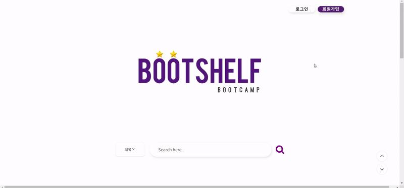
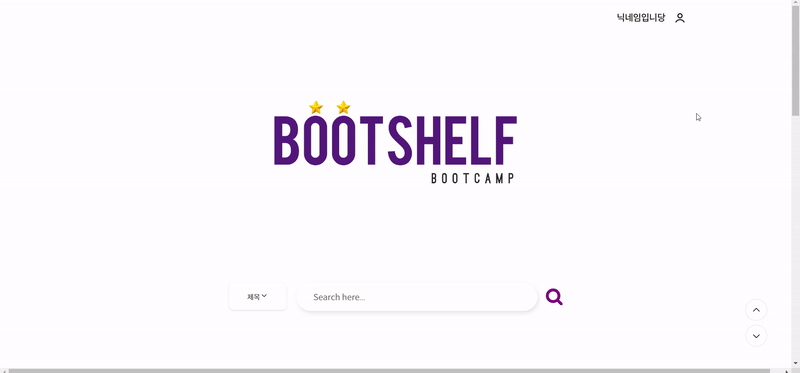
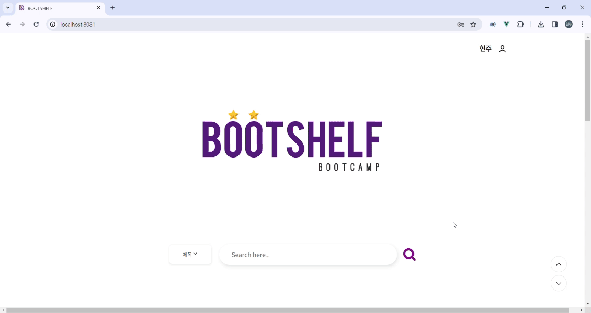
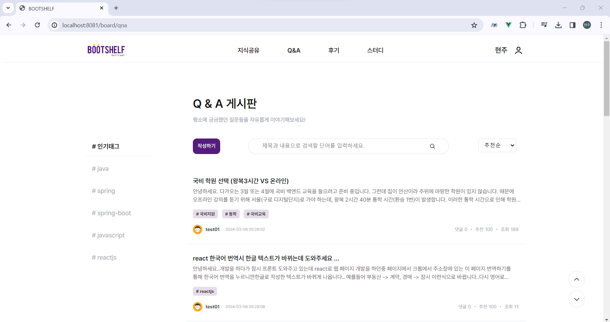
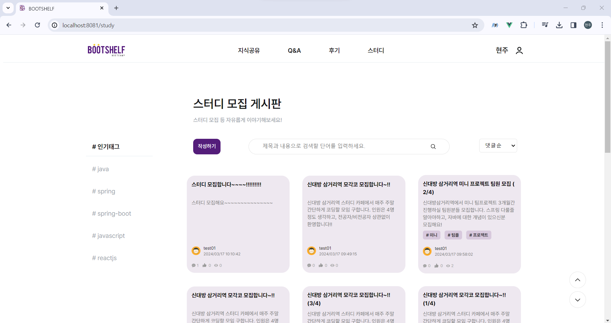
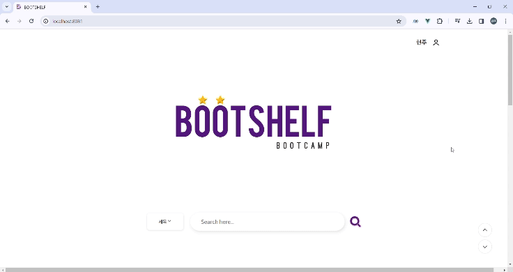
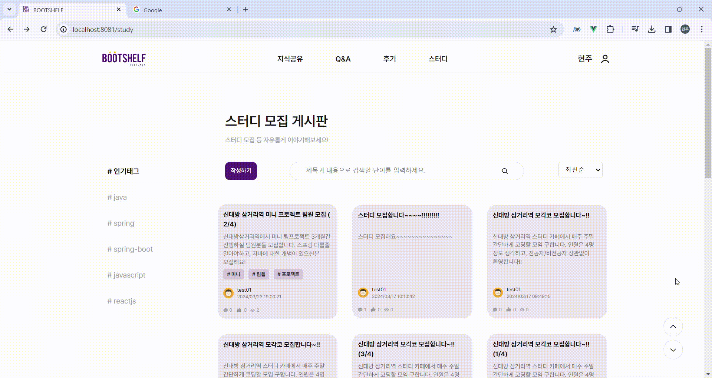

## 🔥 STACKS

&nbsp;&nbsp;&nbsp;&nbsp;
&nbsp;&nbsp;&nbsp;&nbsp;
&nbsp;&nbsp;&nbsp;&nbsp;
&nbsp;&nbsp;&nbsp;&nbsp;
&nbsp;&nbsp;&nbsp;&nbsp;</a>

&nbsp;&nbsp;&nbsp;&nbsp;</a></a>
&nbsp;&nbsp;&nbsp;&nbsp;</a></a>
&nbsp;&nbsp;&nbsp;&nbsp;</a></a>
&nbsp;&nbsp;&nbsp;&nbsp;</a></a>
&nbsp;&nbsp;&nbsp;&nbsp;

 

## 🔧 화면설계서 <a href="https://www.figma.com/file/EPxkgc0NKKEkoXUjaHuRRm/BuildUp-%ED%99%94%EB%A9%B4-%EC%84%A4%EA%B3%84%EC%84%9C?type=design&node-id=0%3A1&mode=design&t=dESqyR1knoAuCHsU-1"> 바로가기</a>

 

## ⏩ 프로젝트 시연 영상

  
👩‍💼 회　　　원 👨‍💼

 
<!---------------------------------- 회원가입 ---------------------------------------->

### 회원가입

  

    
일반 회원가입 및 이메일 인증

 

➡ 부트캠프를 수강하지 않은 일반 회원이 가입을 할 수 있다.  
➡ 회원 정보 [ 이메일, 패스워드, 이름, 닉네임, 프로필 사진 ]를 입력하여 가입한다.  
➡ 회원이 입력한 이메일로 온 인증메일을 통해 이메일 인증을 완료한 후 로그인이 가능하다.

  

  

    
 인증 회원가입 및 이메일 인증 

 

➡ 부트캠트를 수강한 회원이 부트캠프 내역을 인증하여 가입한다.  
➡ 회원 정보 [ 이메일, 패스워드, 이름, 닉네임, 프로필 이미지, "나의 훈련 이력" 캡처사진] 를 입력하여 가입한다.  
➡ 회원이 입력한 이메일로 온 인증메일을 통해 이메일 인증을 완료한 후 로그인이 가능하다.

  

 

<!---------------------------------- 로그인 ---------------------------------------->

### 로그인

  

    
일반/인증 회원 로그인

 

➡ 부트캠프를 수강하지 않은 일반 회원이 가입을 할 수 있다.  
➡ 회원 정보 [ 이메일, 패스워드, 이름, 닉네임, 프로필 사진 ]를 입력하여 가입한다.  
➡ 회원이 입력한 이메일로 온 인증메일을 통해 이메일 인증을 완료한 후 로그인이 가능하다.

  

 

<!---------------------------------- 로그아웃 ---------------------------------------->

### 로그아웃

  

    
로그아웃

 

➡ 로그인 한 회원은 로그아웃을 할 수 있다.  

  

 

<!----------------------------마이페이지(프로필)------------------------------------->

### 마이페이지 - 프로필

  

    
 회원 정보 수정

 

➡ 마이페이지 - 프로필 메뉴에서 회원 정보 수정이 가능하다.  
➡ 회원이 수정하고 싶은 내용 [패스워드, 닉네임, 프로필이미지] 을 입력하여 회원 정보를 수정한다.

  

  

    
 회원 탈퇴 

 

➡ 마이페이지 - 프로필 메뉴에서 회원 탈퇴가 가능하다.  
➡ 회원이 마이페이지의 "회원 탈퇴" 버튼을 클릭하여 진행한다.

  
  

 

<!----------------------------마이페이지(나의활동) ------------------------------------>

### 마이페이지 - 나의 활동

  

    
 작성글 내역 확인 

 

➡ 일반/인증회원은 마이페이지-나의 활동에서 본인이 게시판별 작성한 게시물을 확인할 수 있다.  
➡ 기본은 최신순이며 드롭다운 메뉴로 추천, 조회, 스크랩, 댓글순으로 조회 가능하다.

  
  

  

    
 스크랩 내역 확인 

 

➡ 일반/인증회원은 마이페이지-나의 활동에서 본인이 게시판별 스크랩 게시물을 확인할 수 있다.  
➡ 기본은 최신순이며 드롭다운 메뉴로 추천, 조회, 스크랩, 댓글순으로 조회 가능하다.

  
  

 

<!-----------------------------------------메인페이지-------------------------------------->

### 메인페이지

  

    
 메인페이지 - 검색 

 

➡ 검색창에 원하는 키워드로 검색할 수 있다.   
➡ 검색 시 제목 or 제목+내용을 선택하여 해당 키워드가 포함된 게시글들을 조회할 수 있다.

#### 제목으로 검색
  

#### 제목+내용으로 검색
  

  

  

    
 메인페이지 - 메뉴 

 

➡ 회원/비회원은 메뉴 이동이 가능하다.  
➡ 메인 페이지에서 스크롤 시 보이는 버튼으로 메뉴 이동이 가능하다.

  
  

 

<!-----------------------------------------게시판 crud-------------------------------------->

### 지식공유, Q&A, 스터디 게시판

  

    
 게시글 전체 목록 조회 

 

➡ 회원/비회원은 작성된 게시물들을 조회할 수 있다.  
➡ 기본은 최신순이며, 드롭다운 메뉴를 통하여 추천, 조회, 스크랩, 댓글순으로 조회 가능하다.

#### - 지식공유 게시판

  

#### - Q&A 게시판

  

#### - 스터디 게시판

    
  

  

    
  게시글 상세 조회 

➡ 회원/비회원은 작성된 게시물들을 상세 조회할 수 있다.

#### 지식공유, QnA 게시판도 동일합니다.

  
  

  

    
 게시글 검색 

 

➡ 회원/비회원은 검색창에 키워드를 입력하여 검색하면 제목+내용에 포함된 게시글들을 조회 가능하다.  
➡ 기본은 최신순이며, 드롭다운 메뉴를 통하여 추천, 조회, 스크랩, 댓글순으로 검색 가능하다.

#### 지식공유, 스터디 게시판도 동일합니다.

  

  

  

    
 게시글 작성 

 

➡ 일반/인증회원은 게시글을 작성할 수 있다.  
➡ 게시글 목록에서 작성하기 버튼으로 게시글 작성 페이지로 이동할 수 있다.  
➡ [ 카테고리, 제목, 태그, 내용 ] 을 입력하여 등록한다.

  

  

  

    
 게시글 수정 

 

➡ 일반/인증회원은 게시글을 수정할 수 있다.  
➡ 마이페이지 - 나의 활동에서 작성글 탭, 카테고리[지식공유, Q&A, 스터디]를 선택하여 수정 페이지로 이동한다.  
➡ [ 제목, 태그, 내용 ]을 입력하여 수정한다.

     
  

  

    
 게시글 삭제

 

➡ 일반/인증회원은 지식공유, Q&A , 스터디 게시판의 게시글을 삭제할 수 있다.  
➡ 마이페이지 - 나의 활동에서 작성글 탭, 카테고리[지식공유, Q&A, 스터디]를 선택하여 희망하는 게시글을 삭제한다.

     
  

 
<!-----------------------------------------후기 crud-------------------------------------->

### 후기 게시판

  

    
 게시글 전체 목록 조회 

 

➡ 회원/비회원은 작성된 게시물들을 조회할 수 있다.  
➡ 과정후기, 강사후기 선택하여 조회할 수 있다.  
➡ 기본은 최신순이며, 드롭다운 메뉴를 통하여 추천, 조회, 스크랩, 댓글순으로 조회 가능하다.

  
  

  

    
 게시글 상세 조회 

 

➡ 회원/비회원은 작성된 게시물들을 상세 조회할 수 있다.
 
  
  

  

    
 게시글 작성 

 

➡ 인증회원은 후기 게시판에 게시글을 작성할 수 있다.  
➡ 게시글 목록에서 작성하기 버튼으로 게시글 작성 페이지로 이동할 수 있다.  
➡ [ 카테고리, 제목, 내용, 과정명, 평점 ] 을 입력하여 등록한다.

  
  

  

    
 게시글 수정 

 

➡ 인증회원은 게시글을 수정할 수 있다.  
➡ 마이페이지 - 나의 활동에서 작성글 탭, 카테고리 [ 후기 ]를 선택하여 수정 페이지로 이동한다.  
➡ 수정하고 싶은 [ 제목, 별점, 내용 ]을 입력하여 수정한다.

  
  

  

      
 게시글 삭제 

 

➡ 인증회원은 후기 게시판의 게시글을 삭제할 수 있다.  
➡ 마이페이지 - 나의 활동에서 작성글 탭, [과정후기, 강사후기]를 선택하여 희망하는 게시글을 삭제한다.

  
  

 

<!-----------------------------------------댓글 crud-------------------------------------->

### 댓글

  

    
 댓글 작성 

 

➡ 일반/인증회원은 모든 게시판의 게시글에 댓글을 작성할 수 있다.  
➡ 게시글 상세 조회 페이지에서 댓글 작성이 가능하다.

  

  

  

    
 대댓글 작성 

 

➡ 일반/인증회원은 모든 게시판의 게시글에 대댓글을 작성할 수 있다.  
➡ 게시글 상세 조회 페이지에서 대댓글 작성이 가능하다.

  

  

  

    
 댓글/대댓글 수정 

 

➡ 일반/인증회원은 모든 게시판의 게시글에 대댓글을 수정할 수 있다.  
➡ 게시글 상세 조회 페이지에서 본인이 작성한 댓글/대댓글을 수정할 수 있다.

  

  

  

    
 댓글/대댓글 삭제 

 

➡ 일반/인증회원은 모든 게시판의 게시글에 대댓글을 삭제할 수 있다.  
➡ 게시글 상세 조회 페이지에서 본인이 작성한 댓글/대댓글 삭제이 가능하다.

  

  

 

<!-----------------------------------------게시글 스크랩------------------------------------->

### 게시글 스크랩

  

    
 게시글 스크랩 

 

➡ 일반/인증회원은 모든 게시판의 게시글을 스크랩 할 수 있다.  
➡ 게시글 상세 조회 페이지에서 스크랩 버튼을 클릭하여 스크랩을 할 수 있다.

  

  

  

    
 게시글 스크랩 취소 

 

➡ 일반/인증회원은 모든 게시판의 게시글 스크랩을 취소 할 수 있다.  
➡ 취소1. 본인이 스크랩 한 게시글 상세 페이지에서 버튼을 한 번 더 클릭하여 스크랩을 취소할 수 있다.

#### 취소1
  

#### 취소2
  

  

 
<!-----------------------------------------게시글 추천----------------------------------------->

### 게시글 추천

  

    
 게시글 추천 

 

➡ 일반/인증회원은 모든 게시판의 게시글을 추천할 수 있다.  
➡ 게시글 상세 조회 페이지에서 추천 버튼을 클릭하여 추천을 할 수 있다.

  
  

  

    
 게시글 취소 

 

➡ 일반/인증회원은 모든 게시판의 게시글을 추천 취소할 수 있다.  
➡ 본인이 추천 한 게시글 상세 페이지에서 버튼을 한 번 더 클릭하여 추천을 취소할 수 있다.

  
  

<!-- / 회원 디테일  -->

 
<!-------------------------------------------관리자-------------------------------------------->

  
🧑‍💻 관  　리  　자 👩‍💻

   
<!------------------------------------------ 관리자 회원가입 ----------------------------------------->
  

    
회원가입

 

➡ 관리자만 회원가입을 할 수 있다.  
➡ 관리자 정보 [ 이름, 이메일, 패스워드, 패스워드 확인 ]를 입력하여 가입한다.

  

  

    
로그인

 

➡ 관리자만 로그인을 할 수 있다.  
➡ 관리자 정보 [ 이메일, 패스워드 ]를 입력하여 로그인한다.

  

<!------------------------------------------ 관리자 회원 관리 ----------------------------------------->

### 회원

  

    
조회

 

➡ 관리자는 회원을 조회할 수 있다.

  

  

    
삭제

 

➡ 관리자는 회원을 삭제할 수 있다.

<!------------------------------------- 관리자 게시판 카테고리  ---------------------------------------->

### 카테고리

  

    
등록

 

#### 게시판, 후기 게시판 카테고리 등록 모두 동일한 기능입니다.

➡ 관리자는 게시판 카테고리를 등록할 수 있다.  
➡ 관리자는 [ 카테고리명 ]을 입력하여 등록

  

  

    
조회

 

➡ 관리자는 게시판 카테고리 목록을 조회할 수 있다.

  

  

    
수정

 

➡ 관리자는 게시판 카테고리를 수정할 수 있다.

  

  

    
삭제

 

➡ 관리자는 게시판 카테고리를 삭제할 수 있다.

  

<!---------------------------------------- 관리자 태그 -------------------------------------->

### 태그

  

    
등록

 

➡ 관리자는 태그를 등록할 수 있다.  
➡ 관리자는 [ 태그명 ]을 입력하여 등록

  

  

    
조회

 

➡ 관리자는 태그 목록를 조회할 수 있다.

  

  

    
수정

 

➡ 관리자는 태그를 수정할 수 있다.

  

  

    
삭제

 

➡ 관리자는 태그 목록를 조회할 수 있다.

  

 

